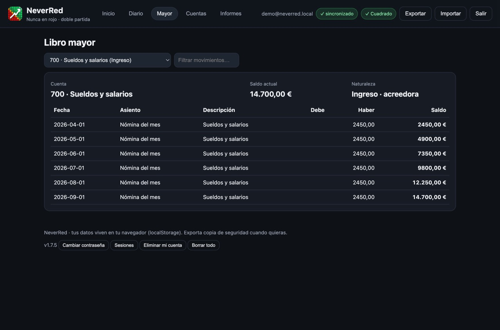

# NeverRed 🟢

Contabilidad personal con el sistema de **doble partida**. Simple para empezar, rigurosa para mantener.

> Cada euro tiene dos caras: de dónde viene y a dónde va. Si **debe = haber**, nunca estarás en rojo sin saberlo.

📖 **Documentación web**: [emilio-devesa.github.io/NeverRed](https://emilio-devesa.github.io/NeverRed/) (guía de uso, despliegue, API y desarrollo).

- [Descargar para macOS](#descargar-para-macos-sin-instalar-nada) · [Puesta en marcha](#puesta-en-marcha-con-usuarios-y-base-de-datos) · [Qué incluye](#qué-incluye) · [Capturas](#capturas) · [Reglas contables](#reglas-contables-aplicadas) · [Estructura](#estructura) · [API](#api) · [Despliegue](#despliegue) · [Releases](#releases-automáticas-con-github-actions)

## Descargar para macOS (sin instalar nada)

1. Descarga el `.dmg` desde **Releases** en GitHub (vale para Intel
   y Apple Silicon: no lleva binarios, solo scripts y el Python de macOS).
2. Ábrelo y arrastra **NeverRed** a **Aplicaciones**.
3. Doble clic en NeverRed: se abre en tu navegador. Listo.

No pide instalar Python ni nada más (usa lo que ya trae macOS). Tus datos
quedan en tu Mac (`~/Library/Application Support/NeverRed`).

## Descargar para Linux (sin instalar nada)

1. Descarga el `.AppImage` desde **Releases** en GitHub.
2. Dale permiso de ejecución (clic derecho → Propiedades → Permisos, o
   `chmod +x NeverRed-*.AppImage`) y haz doble clic.

Tus datos quedan en `~/.local/share/NeverRed`. Para detenerlo del todo:
`./NeverRed-*.AppImage --stop`. Al abrir comprueba actualizaciones
(diálogo con zenity si lo hay; si no, avisa por consola y sigue).

La app comprueba actualizaciones al abrirse: si hay versión nueva muestra
un diálogo con los cambios y opciones de **Instalar** (descarga, sustituye
y reabre sola), **Omitir versión** o **Más tarde**.

NeverRed vive en el Dock mientras está abierta: al salir de ella
(cmd+Q o clic derecho → Salir) se detiene el servidor y no queda
actividad en segundo plano. Volver a abrirla reutiliza el servidor si
ya estaba en marcha. Y si cierras su última pestaña en el navegador,
todo se apaga solo en unos 20 segundos (las demás pestañas no se
ven afectadas).

> La app no está firmada con certificado Apple: la primera vez, ábrela con
> clic derecho → **Abrir** y confirma.

## Puesta en marcha (con usuarios y base de datos)

La app requiere registrarse con correo y contraseña antes de usarla. Los usuarios y sus datos contables se guardan en una base de datos SQLite a través del servidor incluido (solo biblioteca estándar de Python, sin dependencias):

```bash
python3 backend/server.py
```

Abre entonces **http://127.0.0.1:8000** y entra: lo primero es el inicio
de sesión (con casilla **Recuérdame** y lista de usuarios de ese
navegador: avatar, nombre y correo enmascarado; un clic y solo pide la
contraseña, al estilo macOS).
Opciones del servidor: `python3 backend/server.py --port 8001 --host 0.0.0.0`.

Para verla con datos de ejemplo, entra como **Demo** (último en la lista
de acceso) —o por terminal—:

```bash
python3 backend/seed_demo.py   # demo@neverred.local / DemoNeverRed2026
```

> ⚠️ Importante: abre la app desde **http://127.0.0.1:8000**, no con doble clic en `index.html`.
> El archivo abierto directamente (`file://`) no puede guardar en la base de datos; la propia app
> te avisa y te ofrece el enlace correcto más un botón de reintento.

- La BD se crea sola en `backend/neverred.db` (tablas `users`, `sessions`, `user_data`).
- Las contraseñas **nunca** se guardan en texto plano: hash PBKDF2-HMAC-SHA256 con sal aleatoria.
- Las sesiones usan token aleatorio con caducidad de 30 días, servido en
  **cookie `HttpOnly` + `SameSite=Lax`** (`Secure` con TLS). El `Bearer` solo
  se usa en el modo archivo local.
- **Recuperar contraseña**: enlace de un solo uso (1 h) por correo con SMTP
  estándar (`NEVERRED_SMTP_HOST/PORT/USER/PASS/FROM`, `NEVERRED_APP_URL`).
  Sin SMTP, el enlace sale por la consola (desarrollo).
- **Sesiones**: listado propio y rotación (`GET /api/sessions`,
  `POST /api/sessions/rotate`); caducidad con `NEVERRED_SESSION_DAYS`.
- **Autoapagado** (modo `.app`): `NEVERRED_QUIT_WHEN_IDLE=1` apaga el
  servidor al cerrar la última pestaña (`NEVERRED_IDLE_TIMEOUT`, 20 s).
- **Auditoría**: `audit_log` registra accesos, cambios de clave, resets y borrados.
- **Rate-limit**: máx. 10 intentos de login/registro por IP cada 10 min (`NEVERRED_RATE_MAX/WINDOW`).
  Tras un proxy (Caddy, Docker) todos los clientes se ven como una sola IP:
  activa `NEVERRED_TRUST_PROXY=1` **solo** si el proxy es de tu confianza
  (Caddy ya envía `X-Forwarded-For`) para que el límite distinga clientes.
- **CORS restringido** al mismo origen y al modo archivo local.
- **HTTPS**: con `NEVERRED_TLS_CERT` + `NEVERRED_TLS_KEY` el servidor habla TLS. En producción, sírvelo siempre por HTTPS (directo o tras Caddy; ver `Caddyfile`).
- Cada guardado en la app se sincroniza con la BD (con copia local por usuario como caché).
- **Cada usuario tiene su propia contabilidad aislada**: al registrar una cuenta nueva se parte del plan base vacío; al cerrar sesión se borran el estado en memoria y su copia local, y nadie hereda los datos de otro usuario.
- **Tu cuenta es tuya**: puedes cambiar la contraseña (cierra las demás sesiones) o eliminar tu cuenta y todos tus datos desde el pie de la app.
- **Demo**: siempre la última en la lista de acceso; entrar crea o restablece
  sus 6 meses de datos sin pedir contraseña ni tocar a otros usuarios.

> Sin el servidor en marcha (p. ej. abriendo `index.html` directamente), la pantalla de acceso avisará de que no hay conexión.

## Qué incluye

- **Asistente de inicio**: crea tu asiento de apertura (efectivo + banco − deudas = capital inicial).
- **Libro diario**: asientos con N líneas, validación `Debe = Haber`, edición, borrado, filtros y búsqueda.
- **Libro mayor**: movimientos y saldo acumulado por cuenta, con naturaleza deudora/acreedora.
- **Plan de cuentas**: 5 familias (Activo, Pasivo, Patrimonio, Ingreso, Gasto), crear/editar/archivar.
- **Informes**: balance de comprobación (con CSV), cuenta de resultados (PyG) y balance general.
- **Panel**: patrimonio neto, ecuación fundamental en vivo, gráfico ingresos vs gastos 6 meses, accesos rápidos (sueldo, gasto, transferencia).
- **Presupuestos**: límite mensual por gasto con avisos al 80 % y al superar.
- **Recurrentes**: plantillas mensuales (nómina, alquiler) con generación sin duplicados.
- **Importar CSV** del banco (`fecha;descripción;importe`) como asientos cuadrados.
- **PWA**: instalable y carcasa offline (la API necesita red).
- **Tus datos**: viven en la base de datos del servidor y se sincronizan con
  una caché local por usuario. Exporta/importa JSON para copia o traslado.

## Capturas





## Reglas contables aplicadas

- Todo asiento exige ≥ 2 líneas, importes > 0 y `Σ Debe = Σ Haber`.
- Ninguna línea mezcla debe y haber.
- Activo y Gasto son de naturaleza **deudora** (suben por el debe); Pasivo, Patrimonio e Ingreso, **acreedora** (suben por el haber).
- Ecuación verificada en vivo: `Activo = Pasivo + Patrimonio + (Ingresos − Gastos)`.

## Estructura

```
index.html                — vistas + modales + acceso + registro del SW
styles.css                — tema oscuro/claro, responsive
app.js                    — estado, render y sincronización (sin librerías)
lib/contabilidad.js       — lógica contable pura (navegador y tests node)
icon.svg                  — icono pixelado estilo panel de bolsa
manifest.webmanifest, sw.js — PWA instalable con carcasa offline
backend/server.py         — API + SQLite + estáticos (solo stdlib)
backend/backup.py         — copias de la BD con retención
backend/seed_demo.py      — usuario demo con 6 meses de movimientos
backend/tests/            — suite unittest del backend
backend/neverred.db       — base de datos (se crea al arrancar; no se versiona)
packaging/macos/          — Launcher.sh + build.sh (.app + .dmg sin dependencias)
Dockerfile, compose.yaml, Caddyfile — despliegue
.github/workflows/       — ci.yml (push/PR), release.yml + packaging-macos.yml (tags v*)
docs/                     — capturas para este README
```

## API

| Método | Ruta | Descripción |
|---|---|---|
| POST | `/api/register` | `{name, email, password}` → `201 {token, user}` (409 si el correo existe) |
| POST | `/api/login` | `{email, password}` → `200 {token, user}` (401 si falla) |
| POST | `/api/logout` | Invalida el token (cabecera `Authorization: Bearer …`) |
| POST | `/api/password` | `{current, new}` cambia la contraseña y cierra otras sesiones |
| POST | `/api/reset-request` | `{email}` envía enlace de recuperación (1 h, sin filtrar usuarios) |
| POST | `/api/reset-confirm` | `{token, new}` completa la recuperación |
| DELETE | `/api/account` | Elimina el usuario y todos sus datos |
| GET | `/api/me` | Usuario de la sesión actual |
| GET | `/api/sessions` | Sesiones propias (sin exponer tokens) |
| POST | `/api/sessions/rotate` | Cierra todas las sesiones salvo la actual |
| GET | `/api/data` | Datos contables del usuario |
| PUT | `/api/data` | Guarda `{accounts, entries, seq, currency, budgets, recurring}` (validado) |
| POST | `/api/ping` | `{tab}` latido de pestaña para el autoapagado (sin auth) |
| GET | `/api/health` | Salud del servicio → `200 {ok: true, version}` (usado por Docker) |

## Despliegue

### Opción A — Docker (recomendada)

```bash
docker build -t neverred .
docker run -d --name neverred -p 8000:8000 -v neverred-data:/data --restart unless-stopped neverred
```

O con Compose (incluido `compose.yaml`):

```bash
docker compose up -d --build
```

- La BD vive en el volumen (`/data/neverred.db` vía `NEVERRED_DB`) y sobrevive a rebuilds.
- Variables: `HOST` (por defecto `0.0.0.0` en Docker), `PORT`, `NEVERRED_DB`.
- La imagen usa `python:3.12-slim`, usuario no-root y healthcheck contra `/api/health`.
- Backup externo del contenedor (cron del host):
  ```bash
  0 3 * * * docker exec neverred python3 backend/backup.py --db /data/neverred.db --dest /data/backups
  ```

### Opción B — Servidor/VPS clásico

```bash
python3 backend/server.py --host 0.0.0.0 --port 8000
```

Para producción, sirve siempre por **HTTPS**: tras un proxy con TLS automático
(Caddy, con ejemplo listo en `Caddyfile`) o TLS directo con
`NEVERRED_TLS_CERT`/`NEVERRED_TLS_KEY`, y supervísalo
con systemd o similar. Tras Caddy, exporta `NEVERRED_TRUST_PROXY=1` para que
el rate-limit vea la IP real de cada cliente. Copias de seguridad:

```bash
python3 backend/backup.py              # backend/backups/, conserva las 14 últimas
```

o por cron cada noche (ver cabecera del script). La app también permite
Exportar JSON manual. Tests:

```bash
python3 backend/tests/test_server.py   # backend: 14 tests (solo stdlib)
node --test frontend/tests/            # frontal: lógica contable (sin dependencias)
```

## Releases (automáticas con GitHub Actions)

Publicar un tag `v*` dispara los workflows, que verifican todo (suite Python +
tests node), construyen la imagen Docker (→ `ghcr.io/emilio-devesa/neverred`
con tags `X.Y.Z`, `X.Y` y `latest`), generan los `.dmg` de macOS (Intel y ARM)
y crean la Release con notas y comandos de despliegue:

```bash
git tag -a v1.3.0 -m "NeverRed v1.3.0" && git push origin v1.3.0
```

Antes del tag: deja el árbol limpio (`git status`) y actualiza este README si
hay cambios visibles. Al subir versión, actualiza **los dos sitios**:
`VERSION` en `backend/server.py` y `NEVERRED_BUILD` en `app.js` (si no
coinciden, el frontal se autorrefresca en bucle).

### Telemetría de uso (beta)

Opt-in por usuario, apagada por defecto (pie → **Telemetría**). Cuando se
activa, el frontal envía por lotes a `POST /api/telemetry` solo eventos de
un catálogo cerrado (`TELEMETRY_EVENTS` en `backend/server.py`): vistas
abiertas y conteos de acciones (`n_lineas`, `n_filas`). Nunca importes,
textos, nombres ni identificadores — el servidor rechaza (400) cualquier
evento o prop fuera del catálogo. Los datos viven en tu BD con purga a 90
días, se ven en el propio panel, se borran al revocar el consentimiento y
al eliminar la cuenta. **Sin receptor configurado, nada sale de tu servidor**:
el forward es optativo (ver debajo).

En el primer arranque la app pregunta una sola vez (Sí / Ahora no); Esc
aplaza la decisión. El estado vive en `telemetry_consent.asked`.

### Forward hacia tu receptor (beta, store-and-forward)

Si configuras `NEVERRED_TELEMETRY_SINK` (URL del receptor) y
`NEVERRED_TELEMETRY_TOKEN` (secreto compartido), un hilo envía cada 15 min
(`NEVERRED_FORWARD_EVERY`) solo agregados `(instalación, día, hora, evento,
conteo)` más versión, plataforma (solo el SO) y contadores de intentos.
Sin receptor a la vista, reintenta con backoff (1, 2, 4… máx. 60 min); el
receptor hace upsert idempotente. El panel del coordinador
(`telemetry_sink.py`, endpoint `/`) muestra instalaciones totales, picos por
día y por hora, tartas de funciones/versiones/plataformas y fallos medios por
envío — tu señal de si la infraestructura aguanta por uptime.

Receptor mínimo (en tu Mac, dentro de la red Tailscale para la prueba):

```bash
NEVERRED_SINK_TOKEN=<secreto> python3 backend/telemetry_sink.py --host 0.0.0.0 --port 8140
```

Expón cada servicio por donde toque (solo cabe un funnel público por
máquina): el funnel a la app (`tailscale funnel 8000 &`). El sink vive solo
en localhost; las betas sin tailnet llegan a él por el relay
`POST /api/telemetry-ingest` de la propia app (pública), que reenvía al sink
local tras revalidar tamaño y rate-limit — el sink revalida bearer y
allowlist. Con tailnet también vale el sink directo por `serve`.
En cada beta (con o sin tailnet):

```bash
NEVERRED_TELEMETRY_SINK=https://<tu-maquina>.ts.net NEVERRED_TELEMETRY_TOKEN=<secreto>
```

Las builds beta ya traen receptor y token del programa por defecto
(horneados en los lanzadores; el token es público por diseño y se rota por
release). Para el programa beta actual, el receptor debe arrancar con ese
mismo token:

### Firmar los assets (obligatorio para el auto-update)

La app solo instala actualizaciones con firma Ed25519 válida. Tras publicar
la release, firma cada `.dmg`/`.AppImage` y sube el `.sig` como asset:

```bash
ssh-keygen -Y sign -f packaging/release-key -n neverred-update NeverRed-2.0.0.dmg
gh release upload v2.0.0 NeverRed-2.0.0.dmg.sig
```

La privada (`packaging/release-key`) no está en git: guárdala a buen recaudo.
La pública vive en `packaging/release-key.pub` y embebida en los scripts.

Guarda una copia **cifrada** de la privada fuera de este equipo (p. ej.
`gpg -c packaging/release-key` en un USB). Si la pierdes, no podrás firmar
más updates; si se filtra, rota la clave: genera un par nuevo, publica la
`.pub`, y mantén ambas firmas aceptadas durante una versión de gracia antes
de retirar la vieja (los scripts solo traen una clave embebida).
