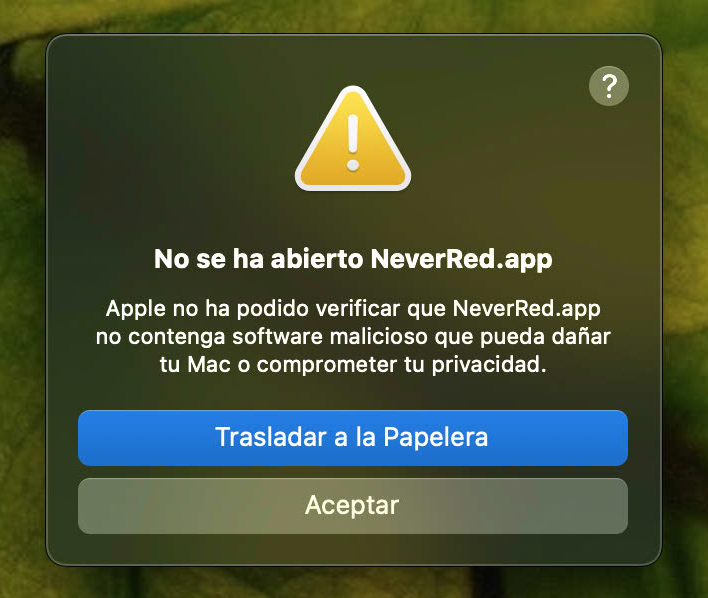
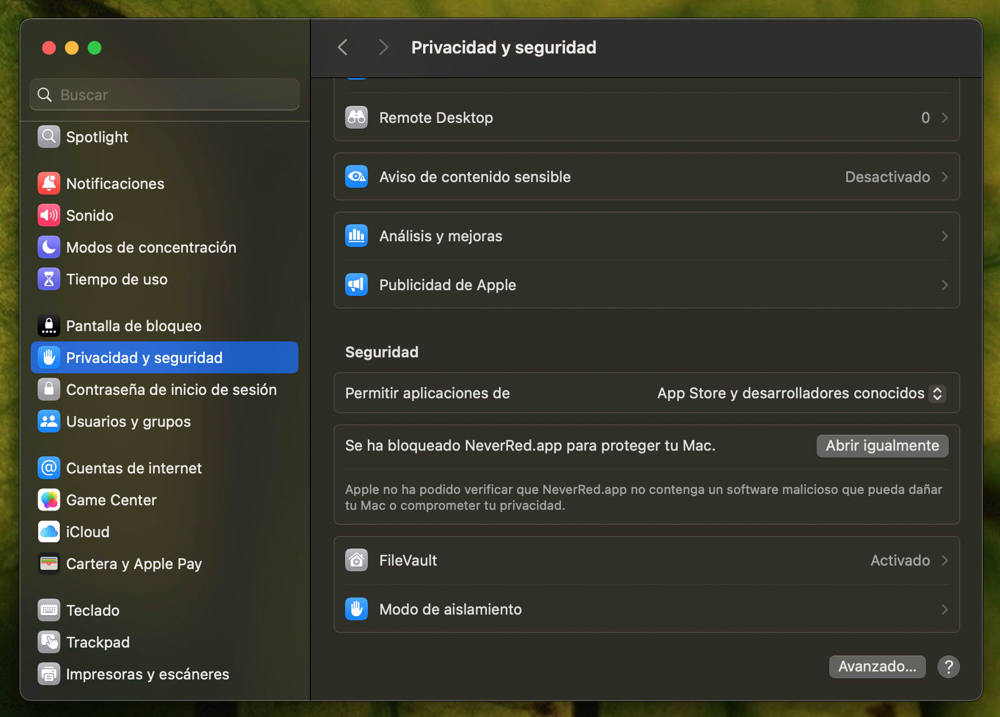
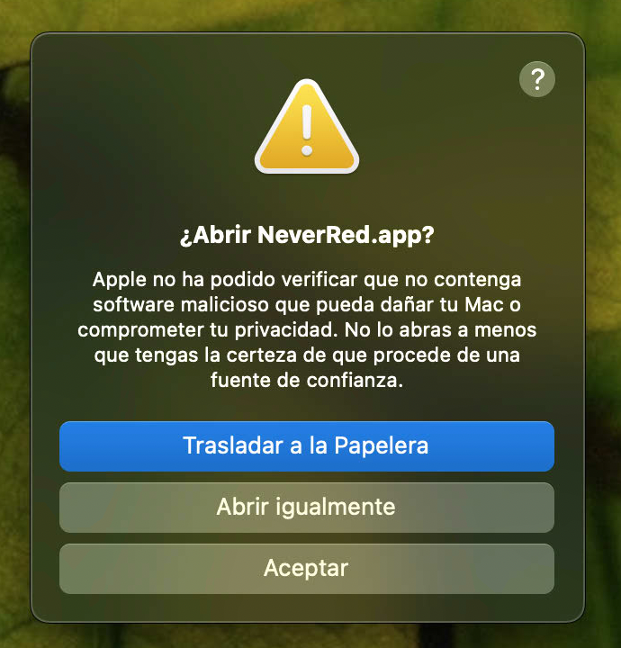

# Guía de uso

## Instalar en macOS (primera vez)

1. Descarga el `.dmg` de [Releases](https://github.com/emilio-devesa/NeverRed/releases) (vale para Intel y Apple Silicon), ábrelo y arrastra **NeverRed** a **Aplicaciones**.
2. Haz doble clic. Como la app no está firmada con certificado Apple, macOS la bloqueará con este aviso (es normal, no es un virus):

3. Pulsa **Aceptar** y abre **Ajustes → Privacidad y seguridad**. Baja hasta el apartado Seguridad: verás el aviso del bloqueo con el botón **Abrir igualmente**:

4. Pulsa **Abrir igualmente** y confirma una última vez:

A partir de ahí la app abre con normalidad y no vuelve a preguntar.

## Entrar

Lo primero es el inicio de sesión, con casilla **Recuérdame**. Encima verás
quién ha usado la app en ese navegador, con avatar, nombre y correo
enmascarado (`dem***@...`): un clic y solo pide la contraseña.
¿Nuevo? Pestaña **Registrarse**. ¿Curioso? **Demo**, siempre la última de la
lista: entra directo con 6 meses de datos de prueba (se restablecen solos,
sin pedir contraseña y sin tocar a otros usuarios).

## La idea en 30 segundos

Cada movimiento se registra **dos veces** por el mismo importe: un **debe** y un **haber**. Ejemplo: cobras 1.500 € → `Debe: Banco 1.500` / `Haber: Sueldos 1.500`. Si algo no cuadra, NeverRed no te deja guardarlo.

## Inicio

Vista general: ecuación fundamental en vivo, patrimonio neto, gráfico de ingresos vs gastos (6 meses), últimos asientos y accesos rápidos (sueldo, gasto, transferencia).

## Diario

El libro de todos tus asientos: crear (con N líneas), editar, **duplicar**, marcar como **↻ mensual**, borrar y buscar. Se ven mes a mes con **‹ Mes anterior / Mes siguiente ›** encima de la lista. Si eliges un rango de **fechas Desde/Hasta** (aunque cruce meses), la navegación por mes se oculta y el título muestra el rango; **Volver al mes en curso** desactiva el filtro. Botón **Importar CSV** para traer movimientos del banco (`fecha;descripción;importe`).

Debajo vive **Asientos recurrentes**: plantillas mensuales (nómina, alquiler) y el botón **Generar pendientes del mes**, que crea lo que falte sin duplicar.

## Mayor

Movimientos y saldo acumulado de cada cuenta, con su naturaleza (**deudora**: Activo/Gasto; **acreedora**: Pasivo/Patrimonio/Ingreso) y filtro por texto.

## Cuentas

Tu plan de cuentas en 5 familias. Crea, edita o archiva cuentas.

## Informes

Balance de comprobación (descargable en CSV), cuenta de resultados, balance general y **presupuestos del mes**: pon un límite a cada gasto y te avisamos al 80 % y al superarlos. Encima del resultado acumulado verás el **PyG del mes**, navegable con ‹ Mes anterior / Mes siguiente › igual que el Diario.

## Tu cuenta

En el pie: cambiar contraseña, ver sesiones activas (y cerrar las demás) o eliminar tu cuenta con todos sus datos. ¿Olvidaste la clave? Usa el enlace de recuperación del login.

## Sincronización entre dispositivos

La insignia junto a tu correo indica el estado: ✓ sincronizado, ● subiendo, ⚠ revisa. Si editas en dos sitios a la vez, la app te avisa y eliges: recargar esos datos o mantener los tuyos.

## Cerrar la app (macOS)

NeverRed vive en el Dock mientras está abierta. Al salir de ella (cmd+Q o clic derecho → Salir) se detiene el servidor sin dejar actividad en segundo plano. Además, si cierras su **última pestaña** en el navegador, todo se apaga solo en unos 20 segundos. Tus otras pestañas no se ven afectadas.

## Actualizaciones (macOS)

Al abrir la app se comprueba si hay versión nueva: verás el diálogo del sistema con los cambios y tres opciones — **Instalar** (descarga, sustituye y reabre sola), **Omitir versión** o **Más tarde**.
