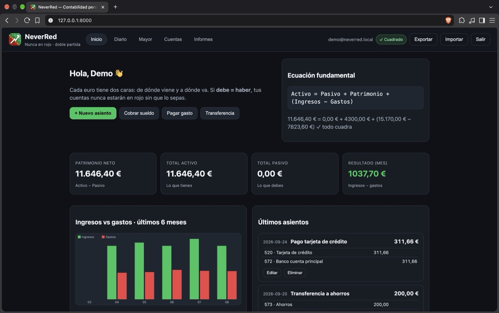
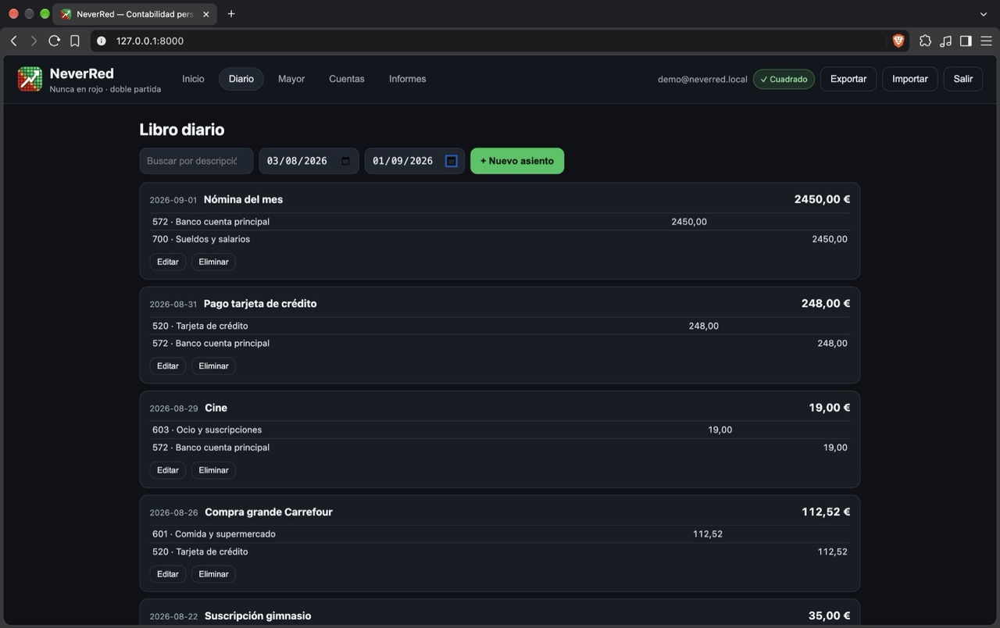
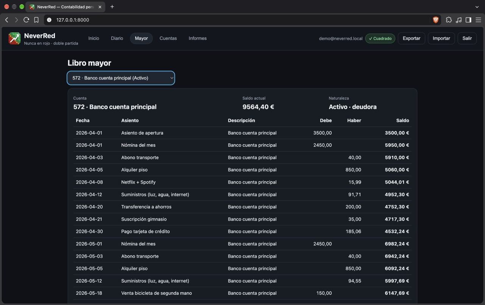

# NeverRed 🟢

Contabilidad personal con el sistema de **doble partida**. Simple para empezar, rigurosa para mantener.

> Cada euro tiene dos caras: de dónde viene y a dónde va. Si **debe = haber**, nunca estarás en rojo sin saberlo.

## Empezar en 1 minuto

**En Mac, sin instalar nada:** descarga el `.dmg` de tu Mac ([Releases](https://github.com/emilio-devesa/NeverRed/releases)), arrástralo a Aplicaciones y haz doble clic.

**Desde código:**

```bash
python3 backend/server.py
```

Abre **http://127.0.0.1:8000**, regístrate con tu correo y crea tu asiento de apertura. O pruébala con datos de ejemplo:

```bash
python3 backend/seed_demo.py   # demo@neverred.local / DemoNeverRed2026
```

## Qué verás





Sigue en la [guía de uso](guia).
