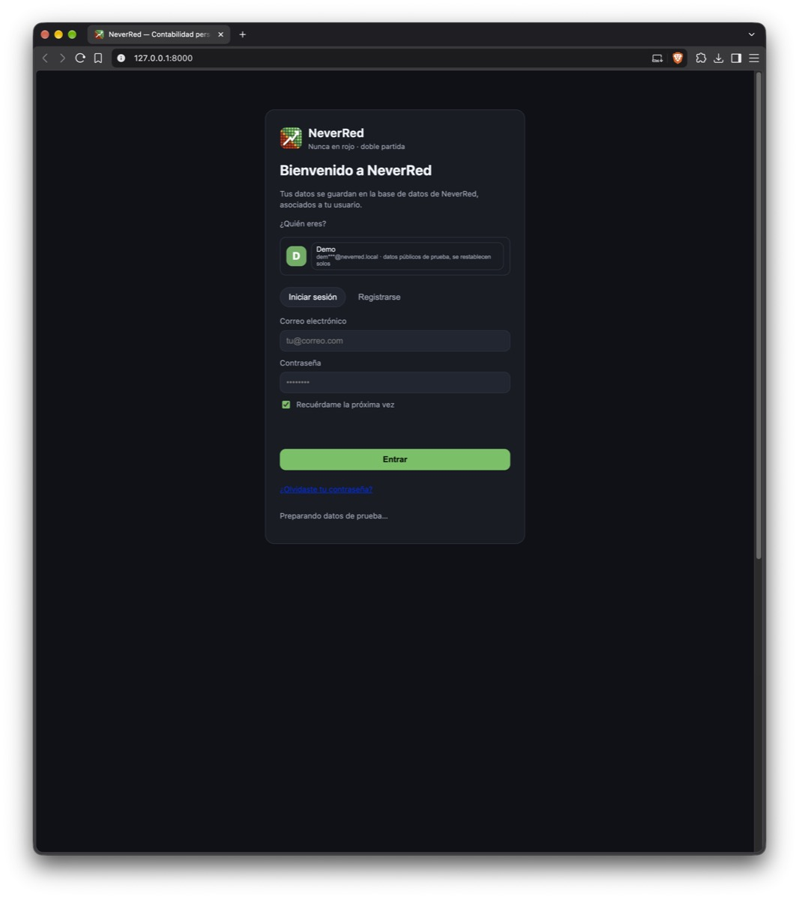
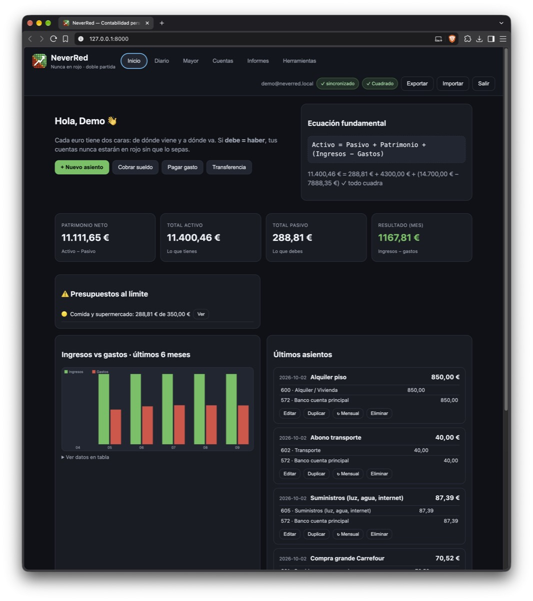
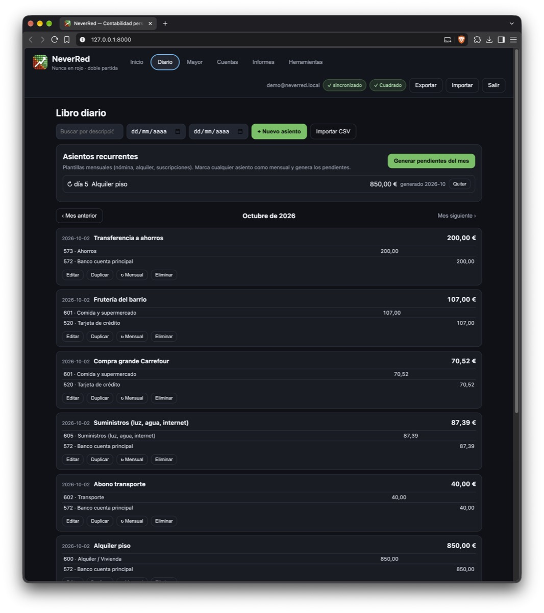
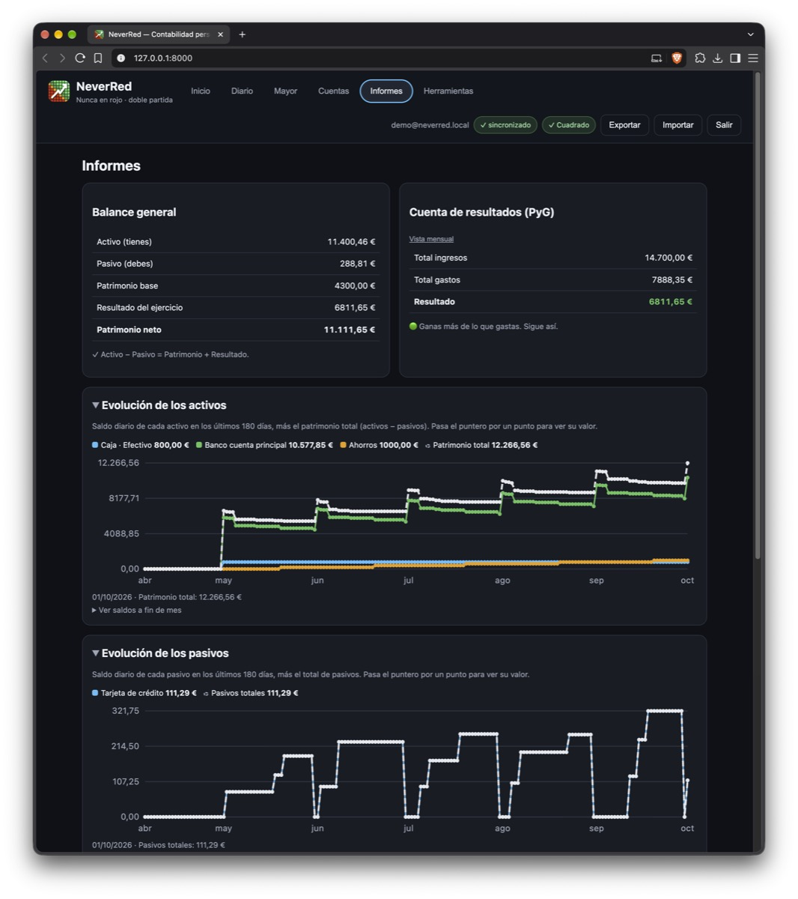
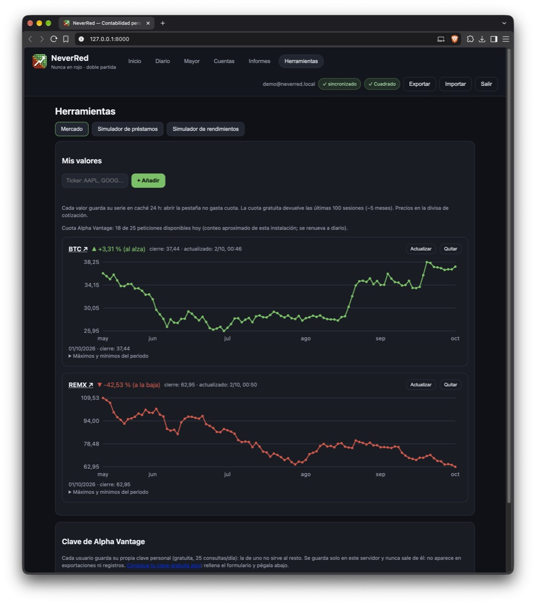

# NeverRed 🟢

Contabilidad personal con el sistema de **doble partida**. Simple para empezar, rigurosa para mantener.

> Cada euro tiene dos caras: de dónde viene y a dónde va. Si **debe = haber**, nunca estarás en rojo sin saberlo.

## Empezar en 1 minuto

**En Mac, sin instalar nada:** descarga el `.dmg` ([Releases](https://github.com/emilio-devesa/NeverRed/releases), vale para Intel y Apple Silicon), arrástralo a Aplicaciones y haz doble clic. Si macOS lo bloquea la primera vez, sigue la [guía de apertura](guia#instalar-en-macos-primera-vez). La app avisa sola cuando hay actualización. Al salir de la app o cerrar su última pestaña, todo se detiene solo.

**En Linux, sin instalar nada:** descarga el `.AppImage` de Releases, dale permiso de ejecución y haz doble clic. Tus datos quedan en `~/.local/share/NeverRed`; `./NeverRed-*.AppImage --stop` lo detiene del todo.

**Desde código:**

```bash
python3 backend/server.py
```

Abre **http://127.0.0.1:8000**, regístrate con tu correo y crea tu asiento de apertura. O pruébala con datos de ejemplo:

```bash
python3 backend/seed_demo.py   # demo@neverred.local / DemoNeverRed2026
```

## Qué verás







Sigue en la [guía de uso](guia).

## Novedades en v2.6.0

Nueva pestaña **Herramientas**: **Mercado** (gráficas de tickers como AAPL o AIR.MC, con tu clave gratuita de Alpha Vantage —cada usuario la suya— y cuota diaria visible), **simulador de préstamos** (cuota francesa con gráfica anual) y **simulador de rendimientos** (interés compuesto con aportaciones). Además, **Informes reordenados**: Balance y PyG lado a lado arriba, evoluciones y comprobación plegables.

## Novedades en v2.0.0

**Telemetría opcional**: la app puede registrar qué funciones usas (solo conteos, nunca importes ni textos) para ayudar a mejorarla. Apagada por defecto —se pregunta una sola vez al entrar— y puedes activarla o desactivarla cuando quieras desde el pie de la app, en **Telemetría**.
